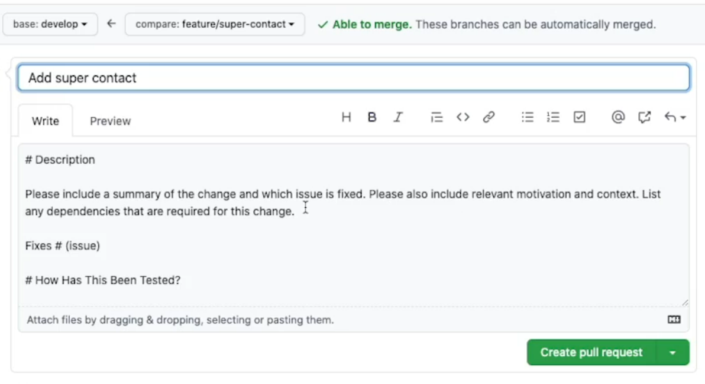

# Criando template para PRs

1. Nesta aula, vamos utilizar o [template](pr-template.md) obtido das urls abaixo.

1. Em seguida, vamos criar uma branch:

```bash
git checkout -b feature/pr
```

3. Agora, vamos criar uma pasta `.github` e dentro desta pasta vamos criar e adicionar o [template](pr-template.md) ao arquivo criado e salvar:

```bash
mkdir .github
```

```bash
vi .github/PULL_REQUEST_TEMPLATE.md
```

4. Após estes passos, vamos adicionar ao repositório remoto:

```bash
git add .
```

```bash
git commit -m "Add Pull Request Template"
```

```bash
git push origin feature/pr
```

5. Agora vamos até o repositório remoto, vamos aceitar o pull request e já deletar a branch


6. Agora, vamos realizar o merge, enviando a `feature/pr`para a `develop` e/ou atualizar o repositório local:

```bash
git checkout develop
```

```bash
git pull
```

```bash
git pull origin feature/pr
```

```bash
git push
```

7. Com o template adicionado, vamos testar, para isto vamos criar uma nova branch `feature/super-contact`, modificar o arquivo `index.html`, adicionar ao stage, criar o commit

```bash
git checkout -b feature/super-contact
```

```bash
vi index.html
```

```bash
git add .
```

```bash
git commit -m "Add super contact"
```

```bash
git push origin feature/super-contact
```

8. Agora, no Github, vamos clicar em `Compare & pull request`e já podemos visualizar o template que foi adicionado




- Link utilizados:
https://embeddedartistry.com/blog/2017/08/04/a-github-pull-request-template-for-your-projects/

https://github.com/embeddedartistry/templates/blob/master/.github/PULL_REQUEST_TEMPLATE.md
